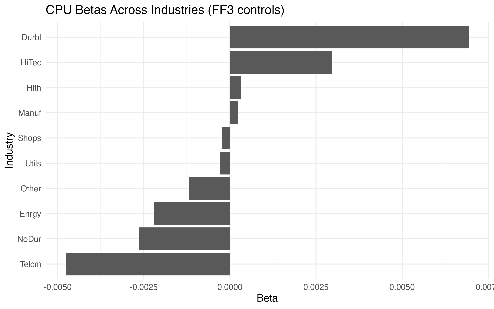
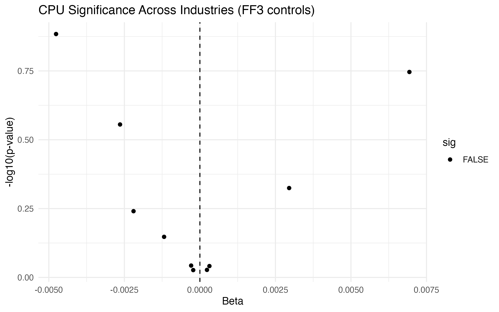
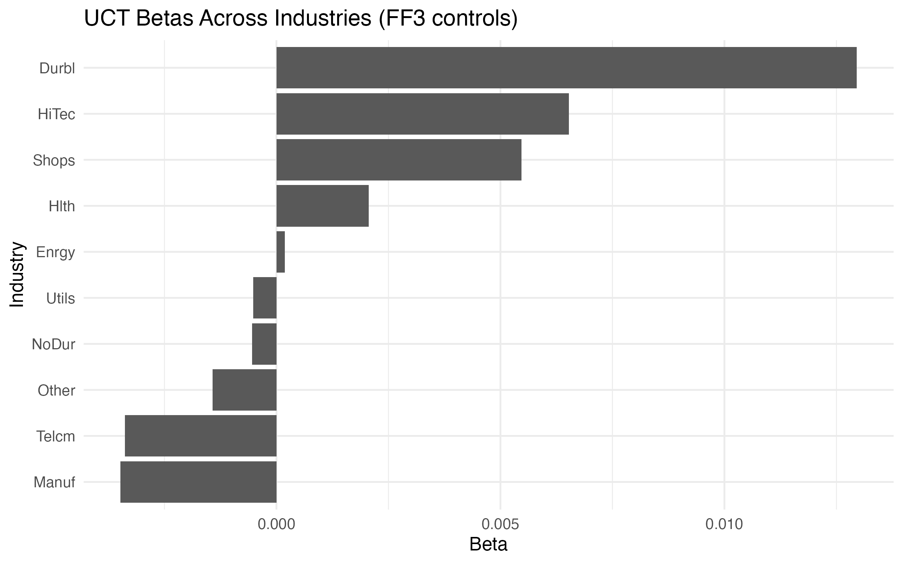

# Policy Uncertainty and Industry Returns  
### Empirical Asset Pricing Project (R)

This project investigates whether policy uncertainty indices contain explanatory power over industry-level stock returns using standard time-series regressions from empirical finance.

It is designed both as an academic-style empirical study and as a portfolio project demonstrating applied quantitative finance and econometrics skills.

---

## Project Objective

The purpose of this project is to examine whether policy-related uncertainty measures affect expected stock returns across industries.

Specifically, I test whether:
- Climate Policy Uncertainty (CPU)
- Uncertainty due to Climate Transition (UCT)

have statistically significant explanatory power for the excess returns of the Fama-French 10 industry portfolios.

---

## Data Sources

All datasets are publicly available and commonly used in academic research:

- Fama-French 10 Industry Portfolios (monthly returns)  
- Fama-French 3 Factors (Market, SMB, HML)  
- Climate Policy Uncertainty (CPU) index  
- Uncertainty due to Climate Transition (UCT) index  

The raw datasets are stored in the `data/` folder.

---

## Methodology

For each industry portfolio, I estimate time-series regressions of the form:

### Baseline specification (no controls)

Excess Return = Alpha + Beta × Uncertainty + Error

### Extended specification (with controls)

Excess Return = Alpha + Beta × Uncertainty  
+ Market Factor + SMB + HML + Error

Where:
- Excess Return refers to industry portfolio returns minus the risk-free rate  
- Uncertainty is either CPU or UCT  
- Market, SMB, HML are the Fama-French risk factors  

This approach follows standard empirical asset pricing practice.

---

## Results Visualization

To complement the regression tables, the project produces visualization outputs that summarize the estimated coefficients and their statistical significance.

### CPU Results (with FF3 controls)

**Betas across industries**


**Statistical significance (volcano plot)**


---

### UCT Results (with FF3 controls)

**Betas across industries**


**Statistical significance (volcano plot)**


---

## Outputs

Running the script produces the following files:

**Tables (in `results/` folder):**
- `CPU_table.csv` — formatted regression table (CPU)  
- `UCT_table.csv` — formatted regression table (UCT)  
- `results.csv` — raw coefficients (baseline model)  
- `results_control.csv` — raw coefficients (FF3 controls)  

**Figures (in `png/` folder):**
- `CPU_betas.png`  
- `CPU_volcano.png`  
- `UCT_betas.png`  
- `UCT_volcano.png`  

These outputs are directly usable in reports, academic-style papers, and portfolio demonstrations.

---

## Limitations

This project is intentionally focused on transparency and replicability rather than causal identification.

- No causal identification strategy (e.g., IV, natural experiments)  
- Results depend on the selected sample period  
- No multiple-testing correction across industries  

These design choices are deliberate, as the goal is to demonstrate clean empirical implementation rather than causal claims.

---

## How to Run the Project

1. Open RStudio  
2. Set the working directory to the project root  
3. Run:

```r
source("scripts/Data An

